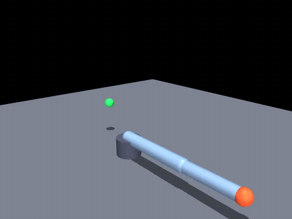

# mujoco-arm-lab

用 MuJoCo 从零搭建一台三自由度机械臂，实现**阻尼最小二乘逆运动学（DLS-IK）**控制末端到达随机目标点。
不依赖任何硬件，Windows 原生可运行。



绿球是随机生成的目标点，橙红色小球是机械臂末端执行器（site `ee`）。

## 实测结果

50 个随机目标点，判据：末端位置误差 < 5 mm，单次最多 8 s 仿真时间。

| 指标 | 结果 |
|---|---|
| 到达成功率 | **100%**（50/50） |
| 平均末端误差 | **0.34 cm** |
| 最差末端误差 | 0.49 cm |
| 平均收敛耗时 | 2.74 s（仿真时间） |

### 换个工况，成功率掉 17 个百分点

上面那个 100% 有个隐含前提：**每个目标点都从初始姿态重新开始**。
改成连续作业、不重置姿态（`03_interactive_viewer.py` 的场景）后：

| 指标 | 逐轮重置（02） | 连续作业（03） |
|---|---|---|
| 成功率 | 100%（50/50） | **82.8%**（303/366） |
| 平均末端误差 | 0.34 cm | 0.40 cm |
| 平均收敛耗时 | 2.74 s | 1.80 s |

20 分钟仿真时间的统计结果。失败的 63 次全部是「超时」而不是「走得不够准」：
机械臂从上一个目标点的姿态出发时，会陷在局部极小或贴住关节限位附近出不来，
单目标超过 8 s 就换下一个。

**同一个控制器，只因评测工况不同，成功率就从 100% 掉到 83%。**
所以报成功率时必须写清「是否每轮重置」，否则数字没有可比性 —— 这是做 benchmark 最容易踩的坑之一。

## 快速开始

```powershell
python -m venv .venv --system-site-packages
.\.venv\Scripts\python.exe -m pip install -r requirements.txt

# 第一步：机械臂动起来，验证模型与渲染链路
.\.venv\Scripts\python.exe 01_first_motion.py

# 第二步：逆运动学到达随机目标点（评测 + 录视频）
.\.venv\Scripts\python.exe 02_reach_target.py

# 只跑评测不录视频，快很多
.\.venv\Scripts\python.exe 02_reach_target.py --n-eval 100 --no-video

# 第三步：弹出 3D 窗口实时看（鼠标左键转视角、滚轮缩放，连续作业模式）
.\.venv\Scripts\python.exe 03_interactive_viewer.py

# 把视频转成 GIF（README 用）
.\.venv\Scripts\python.exe make_gif.py
```

## 目录结构

```
mujoco-arm-lab/
├── models/arm3dof.xml          # 机械臂模型：关节、连杆、执行器、目标点
├── arm_control.py              # 控制核心：目标点采样 + DLS 逆运动学（三个脚本共用）
├── 01_first_motion.py          # 关节空间正弦轨迹，验证渲染链路
├── 02_reach_target.py          # 批量评测 + 录制演示（逐轮重置姿态）
├── 03_interactive_viewer.py    # 交互式 3D 窗口，连续作业模式
├── make_gif.py                 # mp4 → gif（GitHub README 不能直接播放 mp4）
└── outputs/                    # 生成的 mp4 / gif / png
```

## 技术要点

| 概念 | 代码位置 | 说明 |
|---|---|---|
| 正向运动学 | `data.site_xpos[site_id]` | 给定关节角求末端位置，由 MuJoCo 自动计算 |
| 位置执行器 | `arm3dof.xml` 的 `<actuator>` | 写入目标关节角，MuJoCo 内部用 PD 完成跟踪 |
| 雅可比 + DLS | `Reacher.solve_dls()` | 用雅可比把末端误差映射成各关节的增量 |

逆运动学解算公式：

```
dq = Jᵀ (J Jᵀ + λ² I)⁻¹ · err
```

`λ` 是阻尼系数，作用是让手臂接近完全伸展（雅可比接近奇异）时解不会爆炸。

## 调参实验

下面这组数据是扫描出来的，两个结论都反直觉：

| 配置 | 成功率 | 平均误差 | 最差误差 |
|---|---|---|---|
| `MAX_DQ=0.01`, `IK_EVERY=5`（默认） | **100%** | **0.34 cm** | 0.49 cm |
| `MAX_DQ=0.03`, `IK_EVERY=5` | 92% | 0.47 cm | 2.89 cm |
| `MAX_DQ=0.01`, `IK_EVERY=1`（每步都解） | 42% | 2.48 cm | 6.43 cm |
| `LAMBDA=0.2`, `MAX_DQ=0.03` | 98% | 0.49 cm | 3.87 cm |

**结论一：把单步增量从 0.01 放大到 0.03 rad，成功率反而从 100% 掉到 92%。**
位置执行器跟不上跳变的指令，产生超调振荡。控制指令的变化速度必须匹配被控对象的跟踪能力。

**结论二：把 IK 解算频率从每 5 步一次提高到每步一次，成功率从 100% 崩到 42%。**
指令更新率超过伺服带宽，等价于往系统里注入振荡。解得更勤 ≠ 控制得更好。

失败样本全部落在距肩关节 0.52–0.58 m 的接近全伸展区域：那里雅可比接近奇异，
收敛变慢，需要更长的仿真时间才能压进 5 mm。

## Roadmap

- [x] 自建三自由度机械臂模型 + 渲染链路
- [x] DLS 逆运动学到达随机目标点（成功率 100%，平均误差 0.34 cm）
- [x] 交互式查看器 + 连续作业工况评测（暴露 82.8% 的真实成功率）
- [ ] 场景加入障碍物，从「够到点」推进到「避障够到点」
- [ ] 替换为 MuJoCo Menagerie 的真实机型（UR5e / Franka Panda）
- [ ] 接入 Gymnasium + stable-baselines3，用 PPO 训练并与 IK 基线对比

## 环境

- Windows 10/11，Python 3.13
- MuJoCo 3.13.0（`pip install mujoco` 即可，无需 WSL）
- 渲染依赖：`imageio` + `imageio-ffmpeg`
